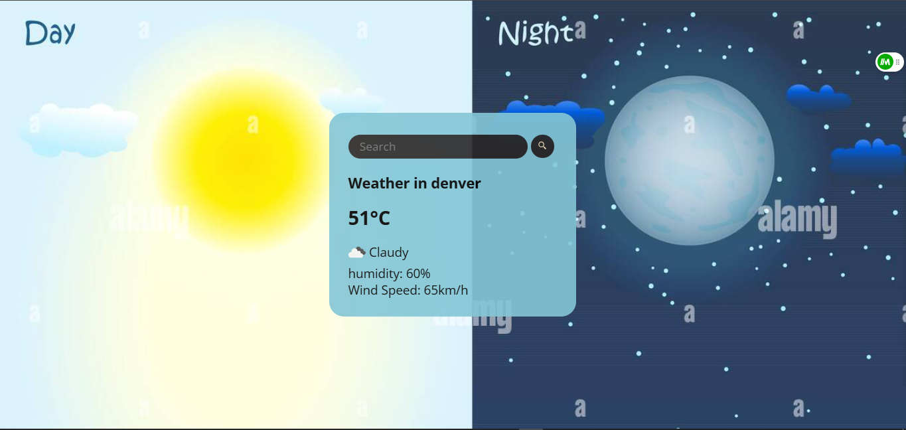

# Weather Web Application

## Overview
This is a simple and responsive web application that provides real-time weather information for any city around the world. The app fetches weather data from the OpenWeatherMap API and displays it in a clean and user-friendly interface. Users can search for a city, and the app will display the current weather conditions, including temperature, humidity, wind speed, and a brief description of the weather.

## Features
- **Search by City**: Users can enter the name of any city to get the current weather information.
- **Real-Time Data**: The app fetches real-time weather data from the OpenWeatherMap API.
- **Responsive Design**: The web app is designed to be responsive and works seamlessly on both desktop and mobile devices.
- **Weather Details**: Displays temperature, humidity, wind speed, and a brief weather description.
- **Dynamic Weather Icons**: Shows weather icons corresponding to the current weather conditions.
- **Error Handling**: Basic error handling is implemented to ensure a smooth user experience.

## Technologies Used
- **Frontend**: HTML, CSS, JavaScript
- **API**: OpenWeatherMap API
- **Fonts**: Google Fonts (Open Sans, Poppins)
- **Icons**: SVG icons for the search button

## Installation
To run this project locally, follow these steps:

### Clone the Repository:
```bash
git clone https://github.com/your-username/weather-web-app.git
cd weather-web-app
```

### Set Up API Key:
- Sign up for a free API key from OpenWeatherMap.
- Replace the `apiKey` value in the `script.js` file with your own API key:

```javascript
let weather = {
    apiKey: "558b591bed5b2d26024b0e16d4f7a8a3",
    // Rest of the code...
};
```

### Run the Application:
- Open the `index.html` file in your browser.
- Alternatively, you can use a local server (e.g., Live Server in VS Code) to run the app.

### Search for a City:
- Enter the name of a city in the search bar and click the search button to view the weather details.

## Project Structure
```
weather-web-app/
│
├── index.html              # Main HTML file
├── style.css               # CSS styles for the app
├── script.js               # JavaScript logic for fetching and displaying weather data
├── weather.jpg             # Background image for the app
│
└── README.md               # Project documentation
```

## Code Explanation

### HTML (`index.html`)
- The HTML file contains the structure of the weather app, including the search bar, weather details, and placeholders for dynamic content.
- It uses Google Fonts for typography and includes an SVG icon for the search button.

### CSS (`style.css`)
- The CSS file styles the app, making it visually appealing and responsive.
- It includes styles for the card layout, search bar, buttons, and weather details.

### JavaScript (`script.js`)
- The JavaScript file handles the logic for fetching weather data from the OpenWeatherMap API.
- It dynamically updates the DOM with the fetched weather data (city name, temperature, humidity, wind speed, and weather description).
- It also includes an event listener for the search button to trigger the API call.

## How It Works
1. **User Input**: The user enters a city name in the search bar and clicks the search button.
2. **API Call**: The app sends a request to the OpenWeatherMap API with the city name and API key.
3. **Data Fetching**: The API returns weather data in JSON format.
4. **Display Data**: The app parses the JSON data and updates the DOM with the relevant weather information.

## Screenshots
### Weather App Screenshot


## Contributing
Contributions are welcome! If you have any suggestions, bug reports, or feature requests, please open an issue or submit a pull request.

### Steps to Contribute:
1. Fork the repository.
2. Create a new branch:
   ```bash
   git checkout -b feature/YourFeatureName
   ```
3. Commit your changes:
   ```bash
   git commit -m 'Add some feature'
   ```
4. Push to the branch:
   ```bash
   git push origin feature/YourFeatureName
   ```
5. Open a pull request.

## License
This project is licensed under the **MIT License**. See the LICENSE file for more details.

## Acknowledgments
- Thanks to OpenWeatherMap for providing the weather data API.
- Inspiration from various weather apps and tutorials.

## Contact
If you have any questions or need further assistance, feel free to reach out:

**Your Name**  
📧 Email: lhlaibiayoub@example.com  
🐙 GitHub: [your-username](https://github.com/ayoub-lah)

Enjoy using the Weather Web Application! 🌦️
